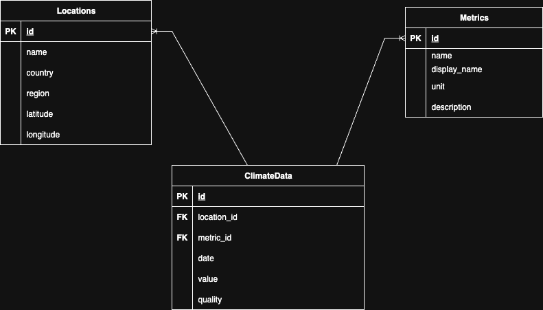

#  EcoVision: Climate Visualizer
This project transforms raw climate metrics into intuitive visuals anyone can understand.

# Index (Table of Contents)

- [EcoVision: Climate Visualizer](#ecovision-climate-visualizer)
- [Setup](#setup)
  - [Clone the Repository](#clone-the-repository)
  - [Create a python virtual environment](#create-a-python-virtual-environment)
  - [Install Dependencies](#install-dependencies)
- [Database Setup](#database-setup)
- [Run Backend and Frontend](#run-backend-and-frontend)
  - [Run the Backend](#run-the-backend)
  - [Run the Frontend](#run-the-frontend)
- [Testing Endpoints using swagger UI](#testing-endpoints-using-swagger-ui)
- [Project Information](#project-information)
  - [Tech Stack](#tech-stack)
  - [Project Structure Backend](#project-structure-backend)
  - [Project Structure Frontend](#project-structure-frontend)
- [Database Schema](#database-schema)
  - [Locations Table](#locations-table)
  - [Metrics Table](#metrics-table)
  - [ClimateData Table](#climatedata-table)
  - [ER Diagram](#er-diagram)
- [Libraries Used](#libraries-used)
- [Challenges Faced (Use of AI Tools)](#challenges-faced-use-of-ai-tools)
- [Future Improvements](#future-improvements)

## Setup

1. **Clone the Repository**
   ```bash
   git clone [reporsitory-url]

2. **Create a python virtual environment**
   ```bash
   python3 -m venv venv
   ```
   **Select python Interpreter for the virtual environment created**
    ```bash
   CMD + SHIFT + P(MACOS)
   ```
   **Activate the virtual environment**
   ```bash
   source venv/bin/activate (macos)
   ```
   **Select python Interpreter for the virtual environment created**
   ```bash
   CMD + SHIFT + P(MACOS)
   ``` 
3. **Install Dependencies**
   ```bash
   cd swe-take-home-1-main
   pip install -r requirements.txt
   ```
## Datbase Setup
1. **Go to backend folder and run load_data**
   ```bash
   cd swe-take-home-1-main/backend
   python3 load_data.py
   ```
## Run Backend and Frontend   
1. **Run the Backend**

   ```bash
   cd backend
   uvicorn app.app:app --reload --port 5000
   ```
2. **Run the Frontend**
   ```bash
   cd we-take-home-1-main/frontend
   npm install
   npm run dev
   ```
## Testing Endpoints using swagger UI

**Navigate to this URL**
 ```bash
      http://127.0.0.1:5000/docs
   ```
## Project Information
### Tech Stack

| Layer     | Technology       | Description                          |
|-----------|------------------|--------------------------------------|
| Backend   | Python           | Programming language for backend     |
|           | FastAPI          | High-performance API framework       |
|           | SQLite           | Lightweight SQL database             |
| Frontend  | React            | JavaScript library for UI components |
|           | Vite             | Frontend build tool and dev server   |
|           | Tailwind CSS     | Utility-first CSS framework          |

### Project Structure Backend
```
└── 📁backend
    └── 📁app
        ├── app.py
    └── 📁db
        ├── climate.db
        ├── execute.py
        ├── load_data.py
        ├── models.py
        ├── queries.py
        ├── session.py
    └── 📁processors
        ├── climate.py
        ├── locations.py
        ├── metrics.py
        ├── summary.py
        ├── trends.py
    └── 📁routers
        ├── climate.py
        ├── locations.py
        ├── metrics.py
        ├── summary.py
        └── trends.py
```

### Project Structure Frontend
```
└── 📁frontend
    └── 📁src
        └── 📁components
            ├── ChartContainer.jsx
            ├── Filters.jsx
            ├── QualityIndicator.jsx
            ├── TrendAnalysis.jsx
        ├── api.js
        ├── App.jsx
        ├── index.css
        ├── main.jsx
    ├── README.md

```


# Database Schema

## Locations Table

| Column      | Type     | Description                     |
|-------------|----------|---------------------------------|
| id          | Integer  | Primary key                     |
| name        | String   | Name of the location            |
| country     | String   | Country of the location         |
| region      | String   | Region or state/province        |
| latitude    | Float    | Geographic latitude             |
| longitude   | Float    | Geographic longitude            |

Relationships:
- `climate_data`: One-to-many with `ClimateData` (back_populates = `location`)

---

## Metrics Table

| Column       | Type     | Description                     |
|--------------|----------|---------------------------------|
| id           | Integer  | Primary key                     |
| name         | String   | Internal metric name            |
| display_name | String   | Human-readable name             |
| unit         | String   | Unit of measurement             |
| description  | String   | Metric description              |

Relationships:
- `climate_data`: One-to-many with `ClimateData` (back_populates = `metric`)

---

## ClimateData Table

| Column      | Type     | Description                                |
|-------------|----------|--------------------------------------------|
| id          | Integer  | Primary key                                 |
| location_id | Integer  | Foreign key → Locations.id                  |
| metric_id   | Integer  | Foreign key → Metrics.id                    |
| date        | Date     | Date of the climate data reading           |
| value       | Float    | Measured value for the metric              |
| quality     | String   | Quality descriptor (e.g., "good", "raw")   |

Relationships:
- `location`: Many-to-one with `Location` (back_populates = `climate_data`)
- `metric`: Many-to-one with `Metric` (back_populates = `climate_data`)

## ER Diagram



# Libraries Used

| Library       | Purpose                                      |
|---------------|----------------------------------------------|
| sqlite-utils  | Simplifies management and querying of the SQLite database storing climate data, such as location and metric records. |
| sqlalchemy    | Powers database interactions, enabling efficient querying and mapping of climate data (e.g., trends, summaries) from the SQLite database. |
| fastapi       | Drives the API backend, providing fast endpoints to serve climate data, trends, and summaries with automatic OpenAPI documentation. |
| uvicorn       | Runs the FastAPI application as an ASGI server, ensuring the climate data API is accessible to the frontend. |
| pandas        | Supports data manipulation and transformation of climate datasets, used for trend analysis and anomaly detection. |
| scipy         | Provides statistical tools, including linear regression, to analyze trends and seasonality in climate data. |

# Challenges Faced (Use of AI Tools)

- **Understanding Data from `sample_data.json`**: Interpreting the structure and content of the `sample_data.json` file posed a challenge, requiring assistance from AI tools to parse and map the data effectively for the climate visualization project.
- **Searching for Formulas for Climate Data Summary and Trends**: Identifying appropriate statistical formulas (e.g., linear regression, IQR for anomalies) for summarizing climate data and detecting trends was time-consuming, with AI tools aiding in research and suggestion.
- **Understanding Those Formulas and Implementing Logic for It**: Comprehending the mathematical concepts behind the formulas.
- **Frontend Wiring Up Dashboard Trends and Summary Endpoint Time Ran Out**: Integrating the frontend dashboard with the trends and summary endpoints was challenging due to time constraints, though completion was limited by the deadline.

# Future Improvements

- **Add a Debugger with Setup for Backend and Frontend**: Implement a debugger configuration (e.g., using VS Code for backend with FastAPI, and React Developer Tools for frontend)
- **Write Test Cases for Backend with Pytest and for Frontend with React Testing Library**: Develop comprehensive unit and integration tests using Pytest for the FastAPI backend and React Testing Library for the frontend
- **Index Database Tables as the Data Grows**: Add indexes to SQLite tables (e.g., on `location_id`, `date`, or `metric_name`) to optimize query performance as the climate data volume increases.
- **Cache with Redis or Perform Pre-Computation**: Implement caching using Redis to store frequently accessed climate data or pre-compute summary statistics and trends, updating and storing these values to enhance retrieval speed for large datasets.